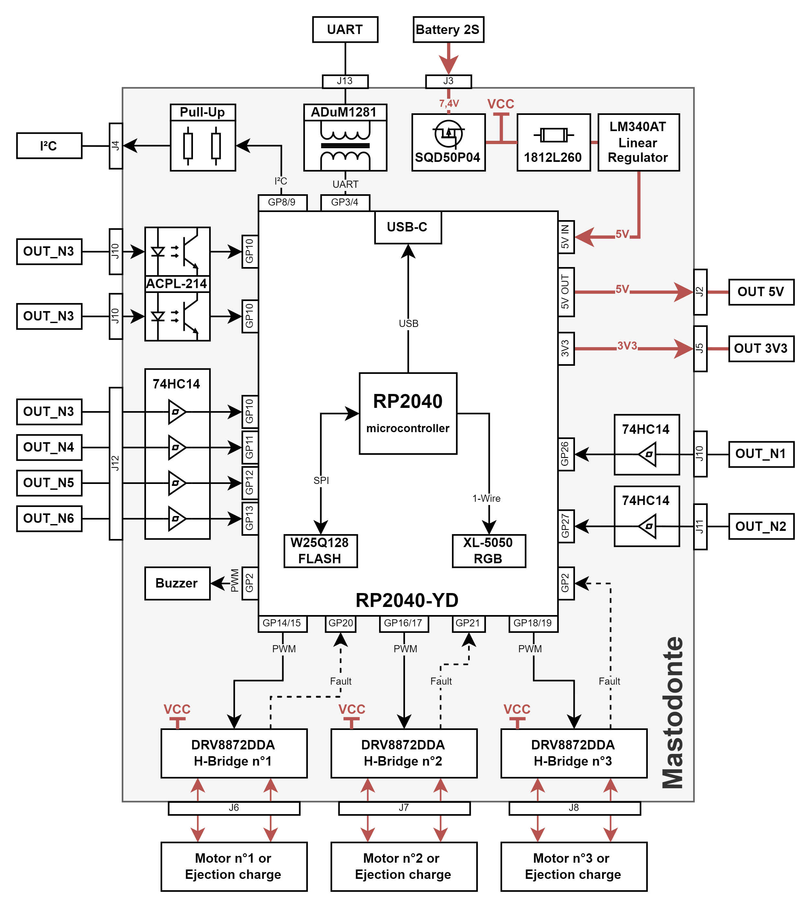
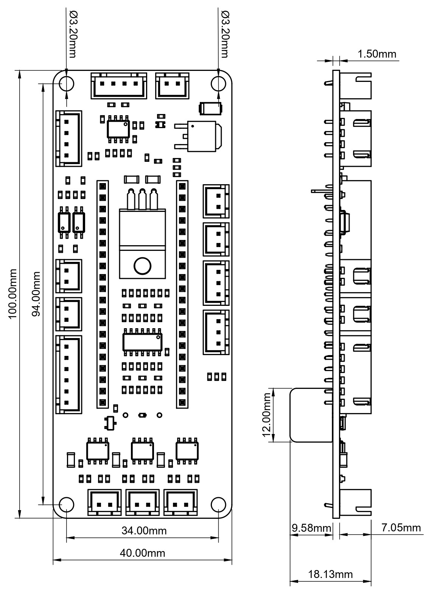

# Mastodonte – Séquenceur avionique 

**Mastodonte** est un ordinateur de bord conçu pour piloter en autonomie les événements critiques d’un vol fusée reposant sur le cahier des charges du C'space.  
Il prend en charge la détection du décollage, le déclenchement des moteurs de séparation, le déploiement des systèmes de récupération, ainsi que l’enregistrement embarqué des données.

---

## Caractéristiques principales

### Alimentation et protection

- Protection contre l’inversion de polarité (MOSFET P SQD50P04-13L)
- Protection contre les surtensions (diode TVS SMAJ14A)
- Limitation de courant par fusible réarmable
- Régulation de tension via LM340AT (entrée batterie → 5V)
- LED d’indication d’alimentation

### Unité centrale

- Microcontrôleur **RP2040**
  - Interface USB-C
  - 12 MB de stockage
  - Gestion des GPIO, I²C, UART, PWM
- Sélection de source d’alimentation par cavaliers (USB ou batterie)

---

## Interfaces et E/S

### Commande moteurs

- 3 drivers DRV8872 (jusqu’à 3.6 A, 6.5–45 V)
- Contrôle PWM de moteurs DC
- Sorties avec LED de direction (diagnostic sans moteur)
- Détection d’erreurs (nFAULT) avec reprise automatique

### GPIO et signaux isolés

- Traitement des entrées par buffers Schmitt Trigger (74HC14)
- Isolation galvanique via optocoupleurs ACPL-214
- Convertisseur de niveau et isolation par ADuM1281
- Connecteurs :
  - GPIO
  - UART
  - SPI
  - PWM
  - I²C (SDA/SCL avec pull-up 4.7k)

### Buzzer de notification

- Commande par transistor BSS138
- Protection contre surtensions (diode flyback 1N4148)
- Activation via signal logique IN_BUZZ

---

## Synoptique 

---

## Connectique

- Connecteurs d'alimentation (entrée/sortie) au format B2B-XH
- Connecteurs pour moteurs, capteurs et modules de commande
- Système modulaire pour intégration dans des architectures complexes

---

## Mechanical

---

## Domaines d'application

- Fusées expérimentales et amateurs
- Plateformes de test multi-étapes
- Systèmes nécessitant un séquencement autonome fiable
