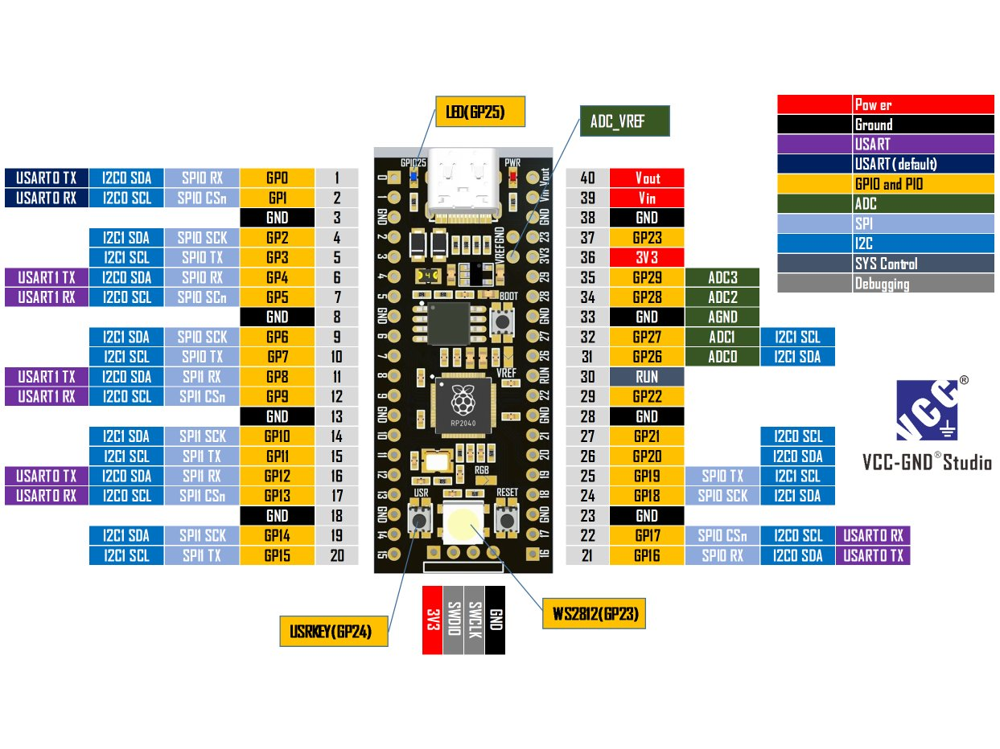

# Mastodonte – Séquenceur avionique

## Introduction

**Mastodonte** est un ordinateur de bord, ou plus précisément un **séquenceur**, conçu pour piloter de manière autonome les événements critiques d’un vol de fusée, en conformité avec le cahier des charges du **C'Space**.

Il assure :
- la détection du décollage,
- l’activation des moteurs de séparation,
- le déploiement des systèmes de récupération,
- ainsi que l’enregistrement des données critiques en vol.

> © 2025 Paul MIAILHE – CC BY-NC-SA 4.0.

  

---

## Architecture & Fonctionnalités

### Alimentation et protections
- Protection contre l’inversion de polarité (MOSFET P **SQD50P04-13L**)
- Protection contre surtensions (**TVS SMAJ14A**)
- Limitation de courant via fusible réarmable
- Régulation de tension (LM340AT : 7.4 V batterie → 5 V)
- Sélection de la source d’alimentation (USB-C ou batterie)
- LED d’indication d’alimentation

### Microcontrôleur RP2040-YD

Mastodonte s’appuie sur une carte **RP2040-YD**, un microcontrôleur compact basé sur le **RP2040** de Raspberry Pi, intégrant les éléments suivants :

- Double cœur **ARM Cortex-M0+** cadencé à 133 MHz
- **128 Mbits (16 MB)** de mémoire flash externe **W25Q128**
- Oscillateur intégré à **12 MHz**
- Interface native **USB-C**
- Format physique compatible **Raspberry Pi Pico**
- Brochage latéral avec **40 broches GPIO** (20 de chaque côté)
- LED RGB **WS2812** intégrée (contrôlée par le GPIO23)
- Boutons embarqués :
  - **BOOT**
  - **RESET**
  - **USER KEY** (GPIO24)
- Interface **SWD** pour débogage

  

Ce module est directement soudé sur le PCB principal, assurant une compacité maximale tout en conservant un accès complet aux fonctionnalités logicielles et matérielles du RP2040.

### Interfaces et connectiques
- Connecteurs au format **B2B-XH**
- Connexions dédiées pour moteurs, charges pyrotechniques, capteurs et interfaces de communication
- Tensions disponibles : **5 V** et **3.3 V**

---

## Interfaces et E/S

### Commande moteur / Charge pyrotechnique
- 3 drivers **DRV8872DDA** (ponts en H)
  - Jusqu’à **3.6 A** sous **6.5–45 V**
  - Contrôle **PWM**
  - LED de direction pour visualisation sans charge
  - Détection d’erreurs via broche **nFAULT**

### Signaux d’entrée isolés
- **Optocoupleurs ACPL-214** pour isolation galvanique
- Buffers logiques **74HC14** (Schmitt trigger) pour traitement numérique
- Isolation UART et conversion de niveau : **ADuM1281**
- Pull-ups 4.7 kΩ intégrés sur les lignes I²C

### Buzzer de notification
- Pilotage via transistor **BSS138**
- Protection par diode **1N4148**
- Activation par GPIO (IN_BUZZ)

---

## Schéma fonctionnel

  

---

## Caractéristiques mécaniques

- Dimensions : **100 × 40 mm**
- Épaisseur maximale : **18.13 mm**
- Trous de fixation : 4 × Ø3.2 mm
- Format adapté aux fusées expérimentales et bancs de test compacts

  

---

## Ressources utiles

- [Datasheet DRV8872](https://www.ti.com/lit/ds/symlink/drv8872.pdf)
- [RP2040 Datasheet](https://www.raspberrypi.com/documentation/microcontrollers/rp2040.html)
- [ACPL-214 Datasheet](https://www.broadcom.com/products/optocouplers/industrial-plastic/acpl-214)

---

© 2024 – Projet Mastodonte  
Licence CC-BY-NC-SA
